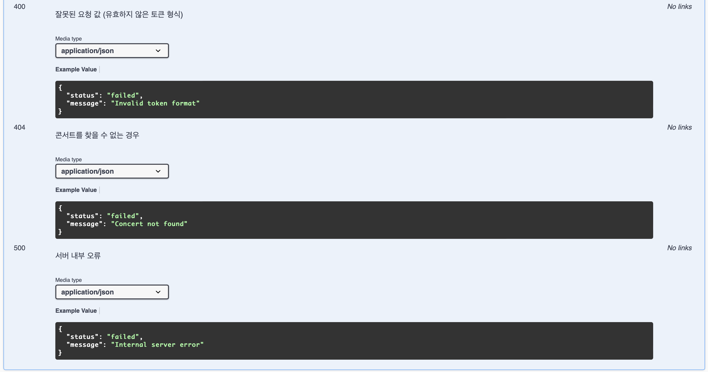
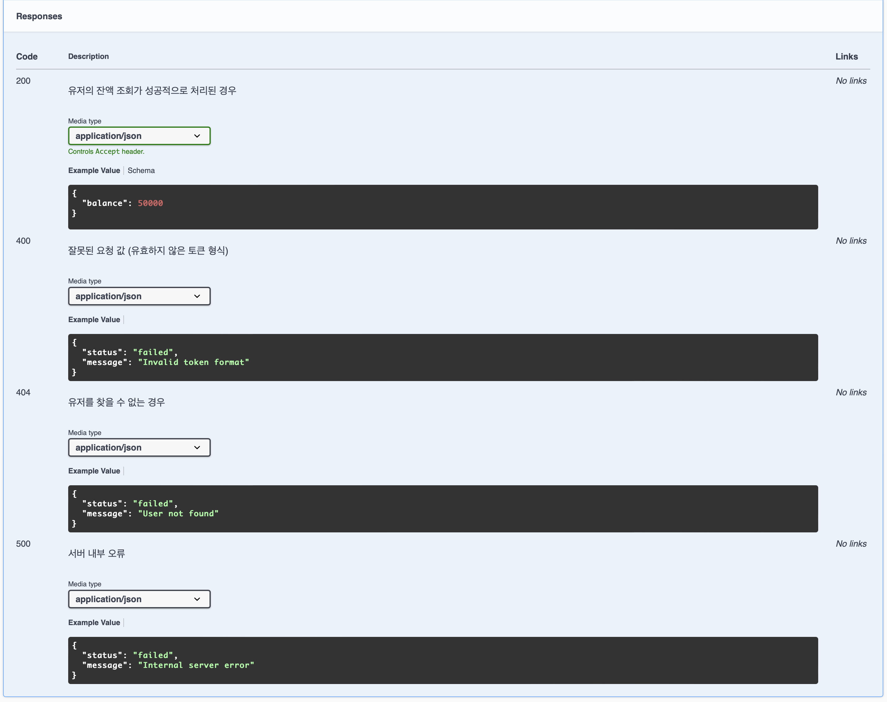
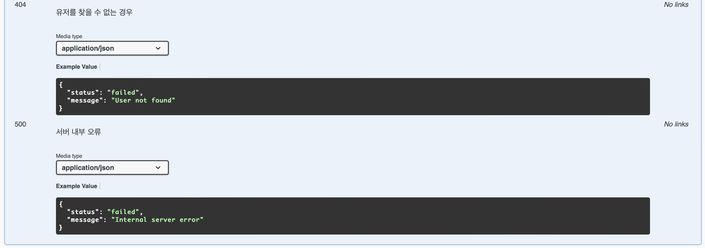

# 콘서트 예약 서비스

## Milestone


<br/>

## 문서

- [시퀀스 다이어그램](docs/sequence_diagram.md)
- [ERD](docs/erd.md)
- [API 명세서](docs/api_specification.md)
- [Chapter 2 중간 회고록](https://eastshine12.tistory.com/67)
- [동시성 제어 방식 비교 및 성능 테스트](https://eastshine12.tistory.com/68)
- [Redis 기반의 캐싱 및 대기열 관리를 통한 콘서트 예약 서비스 성능 개선](https://eastshine12.tistory.com/69)
- [서비스 확장을 위한 트랜잭션 분리와 이벤트 기반 설계](https://eastshine12.tistory.com/71)
- [콘서트 예약 서비스의 인덱스 설계와 성능 비교](https://eastshine12.tistory.com/70)
- [부하 테스트: 유저 행동 기반 시나리오로 시스템 한계 측정과 SLA, SLO 검증](https://eastshine12.tistory.com/72)
- [프로젝트 최종 회고](https://eastshine12.tistory.com/73)

<br/>

## 패키지 구조

```
hhplus
└── concertreservation
    ├── application      # 비즈니스 유스케이스 처리 (Facade 계층)
    │   ├── concert
    │   ├── payment
    │   ├── user
    │   └── waitingQueue
    │
    ├── config           # 전역 설정 및 Bean 정의
    │
    ├── domain           # 핵심 도메인 로직
    │   ├── common       # 공통 규칙, 에러, 이벤트 처리
    │   ├── concert      # 콘서트 도메인 (Entity, Service, Repository 등)
    │   ├── outbox       # Outbox 패턴 구현 (Entity, Repository, Service 등)
    │   ├── payment      # 결제 도메인
    │   ├── user         # 사용자 도메인
    │   └── waitingQueue # 대기열 도메인
    │
    ├── infrastructure   # 외부 시스템 연동 (DB, MQ, API 등)
    │   ├── api          # 외부 API 연동
    │   ├── event        # 이벤트 처리 (Kafka 등)
    │   └── repository   # 데이터베이스 연동
    │       ├── concert
    │       ├── outbox
    │       ├── payment
    │       ├── user
    │       └── waitingQueue
    │
    ├── interfaces       # 외부 인터페이스 (Controller, Filter, Interceptor)
    │   ├── api          # REST API
    │   │   ├── concert
    │   │   ├── payment
    │   │   ├── user
    │   │   └── waitingQueue
    │   ├── consumer     # Kafka Consumer
    │   │   ├── concert
    │   │   ├── outbox
    │   │   ├── payment
    │   │   └── waitingQueue
    │   ├── filter       # HTTP 요청 필터
    │   └── interceptor  # HTTP 요청 인터셉터
```


<br/>

## 기술 스택

- **Language**: Kotlin
- **Framework**: Spring Boot
- **Database**: H2, MySQL
- **Messaging**: Kafka
- **Caching**: Redis
- **Monitoring**: Prometheus, Grafana
- **Build Tool**: Gradle
- **Containerization**: Docker, Docker Compose
- **Test Framework**: JUnit 5, Mockk
- **Load Testing**: K6
- **Version Control**: Git

<br/>

## Swagger API 명세서

### 전체

---


<br/>

### 상세

---

<details>
<summary>콘서트 API</summary>





</details>

---

<details>
<summary>유저 API</summary>





</details>

---

<details>
<summary>대기열 API</summary>


</details>

---

<details>
<summary>결제 API</summary>





</details>


<br/><br/>