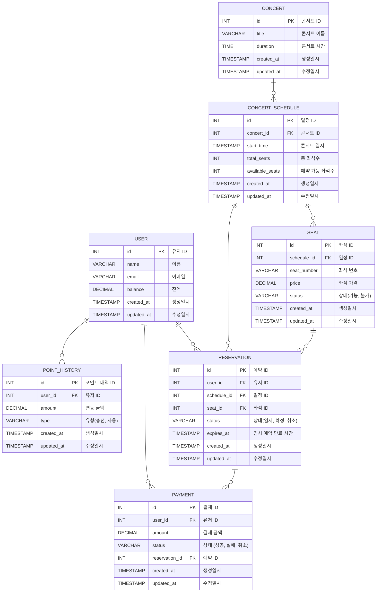

## ER 다이어그램

 

  

### ERD 설계 흐름

#### 1. `user` 테이블에 `잔액(balance)` 필드 추가

- 포인트 이력 테이블을 기반으로 잔액을 계산하는 방식 대신, 충전과 사용 시 `user` 테이블의 잔액 필드도 함께 수정하도록 하였습니다. 잔액 조회 시에 발생할 수 있는 성능 저하를 방지하고 보다 효율적인 조회가 가능하도록 작성했습니다.

#### 2. 콘서트의 회차별 정보를 저장하는 `concert_schedule` 테이블 작성

- `concert` 테이블과 1:N 관계로 각 콘서트의 회차 별 정보 (일시, 좌석 수 등)을 관리하는 테이블을 작성함으로써 독립적으로 관리할 수 있도록 설계했습니다.

#### 3. 좌석 정보를 저장하는 `seat` 테이블 작성

- 각 콘서트 회차에서 개별 좌석에 대한 정보를 관리하는 테이블을 작성했습니다. 유저 입장에서 좌석은 예약 가능 여부가 중요하다 판단되어, 임시 배정에 대한 상태를 `seat` 테이블 대신 `reservation` 테이블에 기록하도록 설계했습니다.

#### 4. `concert_schedule` 테이블에 `available_seats` 필드 추가

- 좌석 수를 실시간으로 `seat` 테이블에서 `COUNT(*)`를 통해 계산하지 않고, 예약 가능 좌석 수를 바로 조회할 수 있도록 `concert_schedule` 테이블에 `available_seats` 필드를 추가하였습니다. 이 부분도 좌석 수 조회 시 성능을 개선하기 위해 작성했습니다.

#### 5. `seat` 테이블과 `reservation` 테이블을 분리하여 관리

- 좌석과 예약 정보를 구분하기 위해 `seat` 테이블과 `reservation` 테이블을 나누었습니다. 이를 통해 좌석에 대한 `임시 예약`, `확정 예약`, `취소` 상태를 명확하게 관리할 수 있도록 하였습니다. 좌석 상태를 독립적으로 관리하여 예약의 상태 변화에 따른 영향을 최소화 했습니다.

#### 6. 임시 배정 해제를 위한 `expires_at` 필드 추가

- 좌석의 임시 배정에 대한 자동 해제 기능을 구현하기 위해 `reservation` 테이블에 `expires_at` 필드를 추가하였습니다. 이를 통해 해당 시간이 지나면 임시 배정이 자동으로 만료되도록 하는 요구사항을 반영하도록 작성했습니다.

  