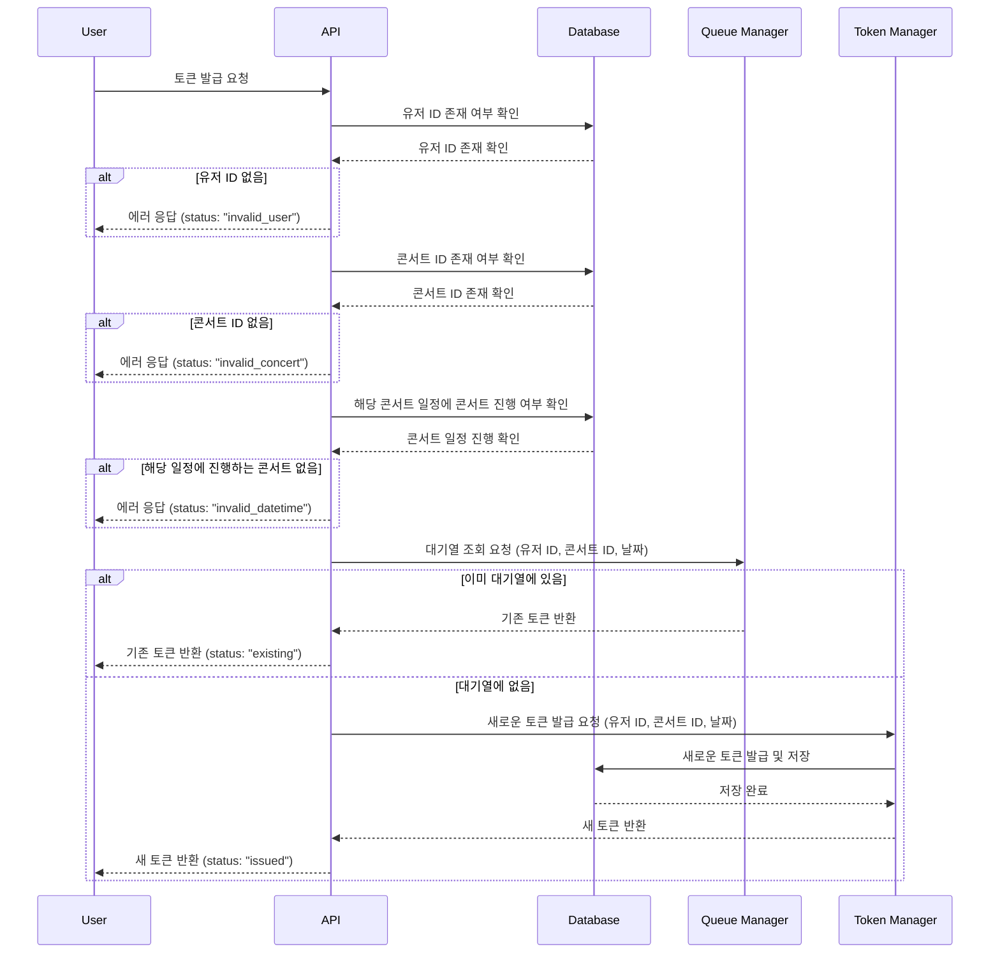
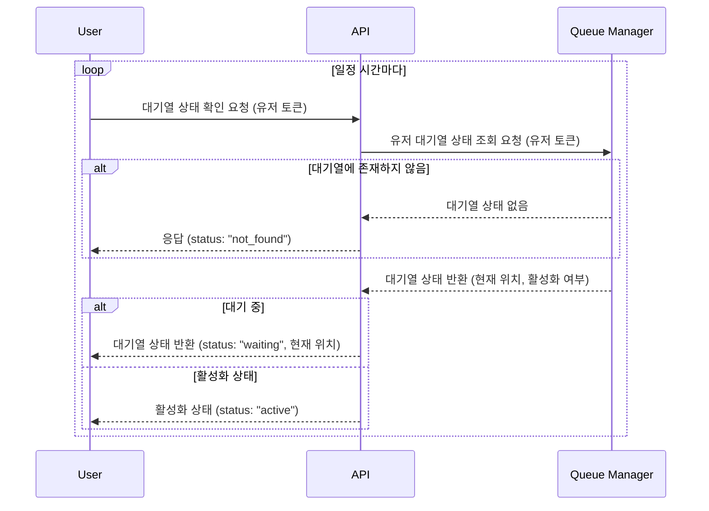
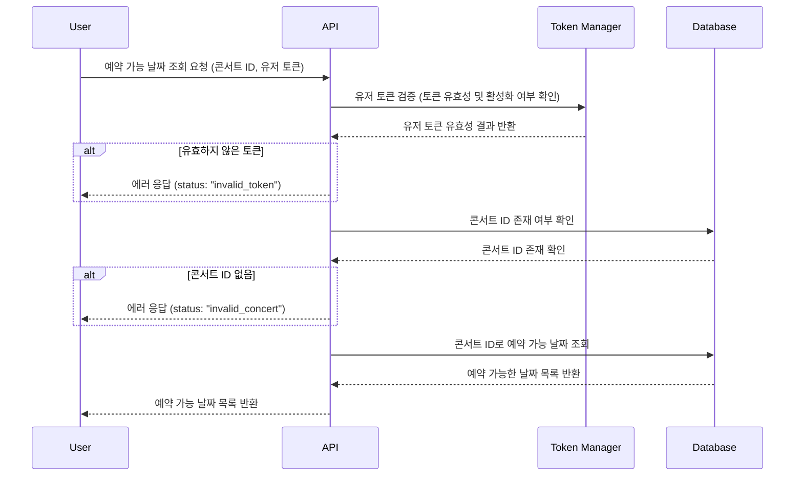
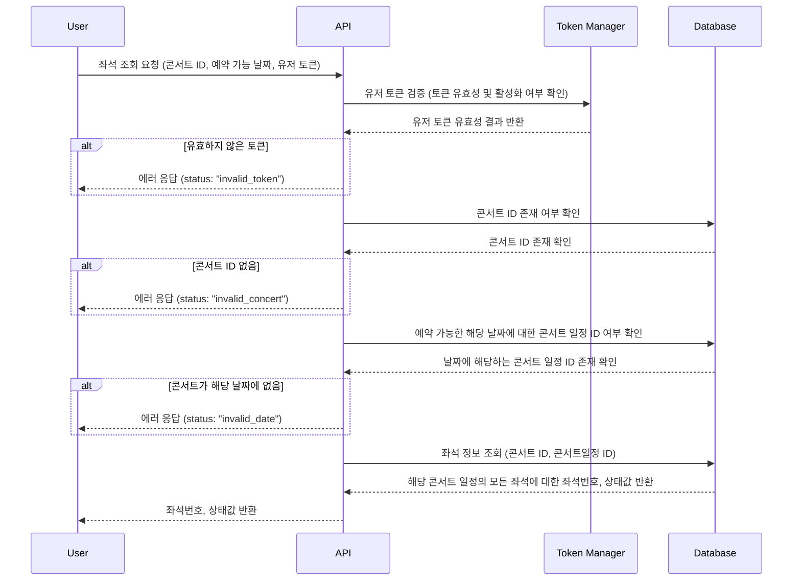
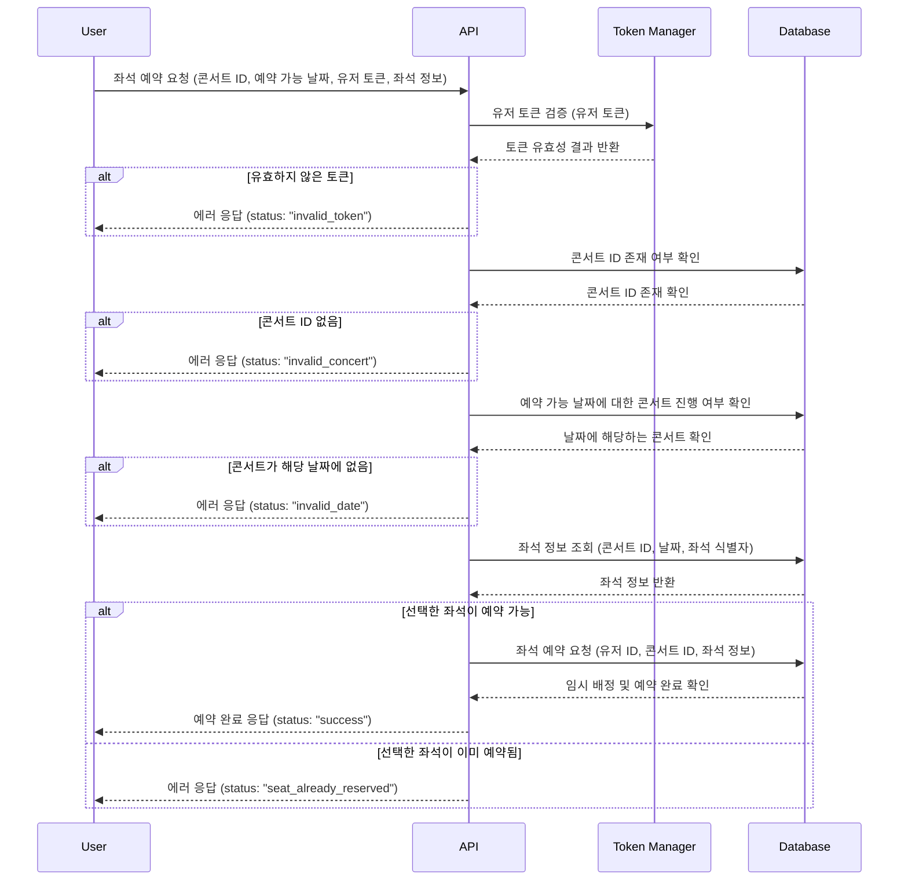
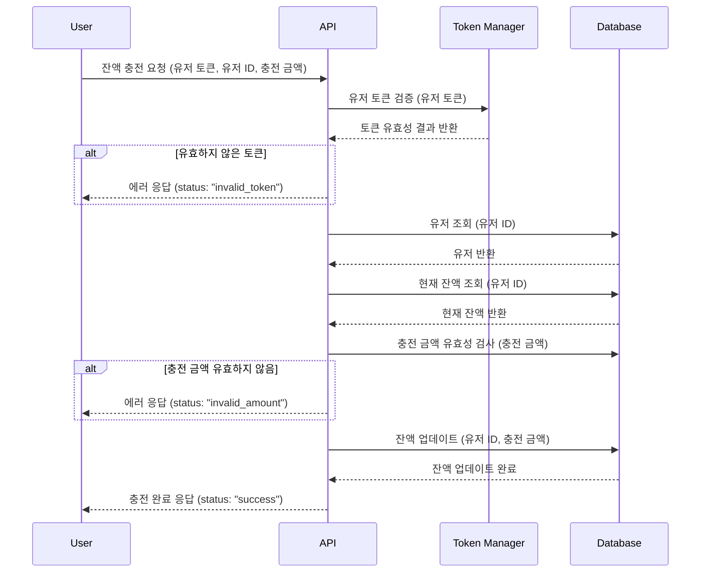
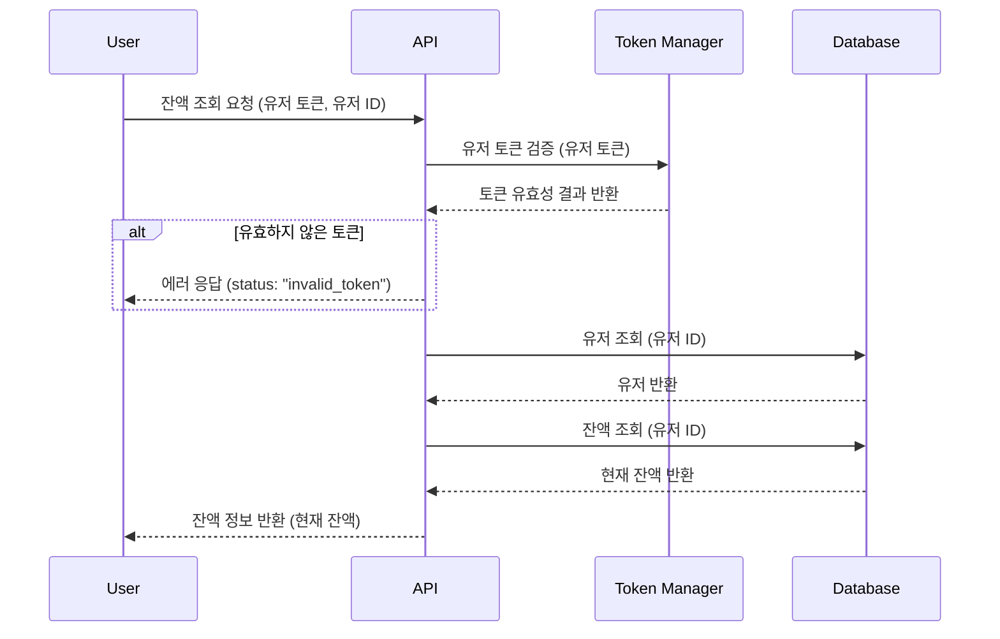
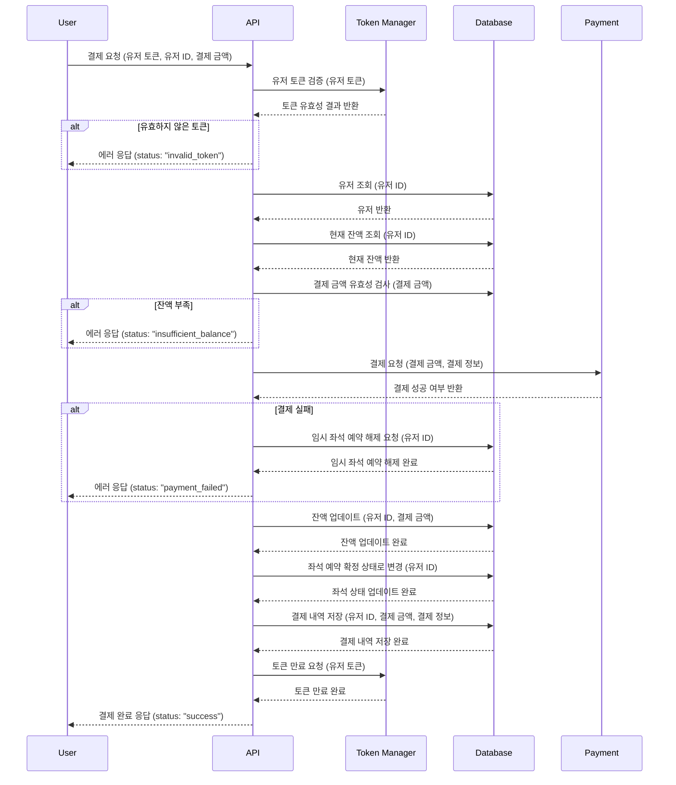
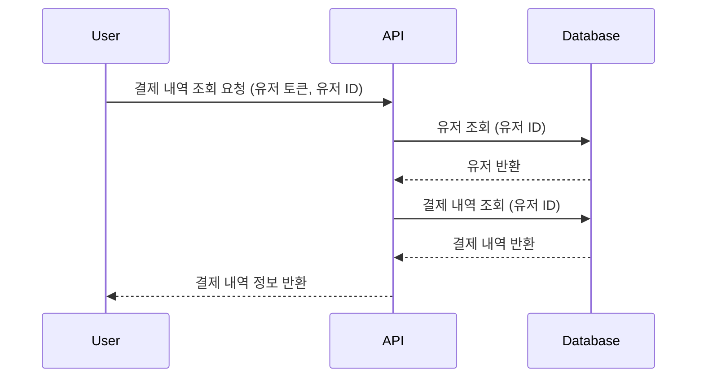

## 시퀀스 다이어그램

### 1. 유저 토큰 발급
사용자가 콘서트 예매에 대한 대기열 토큰을 발급받기 위해 필요한 과정을 정의했습니다.
유저, 콘서트, 콘서트 일정의 유효성을 검증한 후, 대기열에 있는지 확인하여 이미 존재하는 경우에는 기존 토큰을 반환하고, 새로운 경우에는 새로 발급하여 제공합니다.

   

### 2. 대기열 조회
사용자가 대기열의 상태를 주기적으로 확인하는 과정을 정의했습니다.
대기열에서의 현재 위치와 활성화 여부를 확인하고, 대기열에 존재하지 않는 경우에는 에러 응답을 반환합니다.

   

### 3. 예약 가능 날짜 조회

사용자가 특정 콘서트의 예약 가능 날짜를 조회하는 과정을 정의했습니다.
유효한 토큰과 콘서트 ID를 검증한 후, 데이터베이스에서 예약 가능한 날짜 목록을 반환합니다.

   

### 4. 예약 가능 해당 날짜에 대한 좌석 조회

특정 콘서트의 예약 가능한 날짜에 대한 좌석 정보를 조회하는 과정을 정의했습니다.
유저의 토큰과 콘서트 ID의 유효성을 확인한 후, 해당 날짜에 대한 좌석 상태를 반환합니다.

   

### 5. 좌석 예약 요청

사용자가 좌석을 예약하는 과정을 정의했습니다.
유저의 토큰 검증 후 콘서트와 좌석의 유효성을 확인하고, 좌석이 예약 가능할 경우 예약을 진행합니다.

   

### 6. 잔액 충전

사용자가 잔액을 충전하는 과정을 정의했습니다.
토큰 검증 후 유저의 현재 잔액을 확인하고, 충전 금액의 유효성을 검증한 뒤 잔액을 업데이트합니다.

   

### 7. 잔액 조회

사용자가 잔액을 조회하는 과정을 정의했습니다.
토큰 검증 후 유저에 대한 유효성을 확인하고, 유저의 잔액 정보를 반환합니다.

   

### 8. 결제

사용자가 예약한 좌석에 대한 결제를 진행하는 기능을 정의했습니다.
토큰 검증 후 유저와 현재 잔액, 결제 금액에 대한 유효성을 검사하고 결제를 요청합니다.
결제에 실패한 경우 임시 좌석에 대한 예약을 해제하도록 요청하고, 결제에 성공한 경우 잔액, 좌석 상태, 예약 상태, 토큰 상태를 업데이트하고 결제 내역을 저장합니다.

   

### 9. 결제 내역 조회

사용자가 과거의 결제 내역을 조회할 수 있도록 하는 기능을 정의했습니다.
유저에 대한 유효성을 검사하고 결제 내역을 반환합니다.

   
